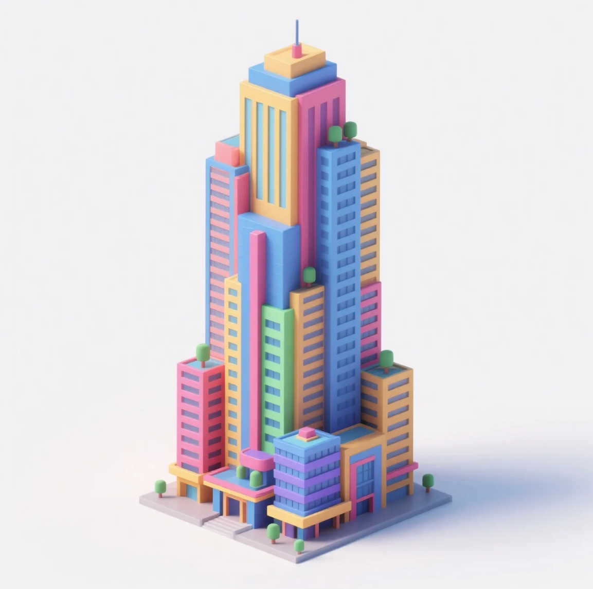

# Reality 3D

Reality 3D is an advanced AI-powered 3D generation and reality digitization platform that transforms the way we create, preserve, and interact with 3D content. By combining cutting-edge AI technology with decentralized architecture, Reality 3D enables anyone to generate high-fidelity 3D models and contribute to a global digital archive of our world.

## Features

- **AI-Driven 3D Generation**: Transform images, text, or sketches into detailed 3D models
- **Reality Digitization**: Preserve real-world locations and artifacts in 3D digital form
- **Cross-Modal Generation**: Support for multiple input types including photos, text, and voice
- **Collaborative Creation**: Enable global users to contribute and create together
- **Decentralized Storage**: Utilize blockchain technology for secure and distributed asset storage
- **High-Performance Rendering**: Advanced rendering engine for real-time visualization
- **Customizable Workflows**: Flexible pipeline configuration for different use cases
- **API Integration**: Comprehensive REST API and SDKs for seamless integration

## Project Structure

```
Reality3D/
├── src/
│   ├── ai/            # AI model implementations
│   │   ├── models/    # Neural network architectures
│   │   ├── training/  # Training pipelines and utilities
│   │   └── inference/ # Model inference and optimization
│   ├── core/          # Core platform functionality
│   │   ├── storage/   # Asset storage and management
│   │   ├── render/    # 3D rendering engine
│   │   └── pipeline/  # Processing pipeline
│   └── web/           # Web interface and API
│       ├── frontend/  # React-based UI components
│       ├── backend/   # Express.js server implementation
│       └── api/       # REST API endpoints
├── contracts/         # Smart contract implementations
├── tests/            # Comprehensive test suites
├── scripts/          # Deployment and utility scripts
├── docs/             # Documentation
└── examples/         # Example applications and demos
```

## Getting Started

### Prerequisites

- Python 3.8+
- CUDA-compatible GPU (for AI model training)
- Node.js 16+
- Docker 20.10+
- Rust 1.60+ (for core components)

### Environment Setup

```bash
# Clone the repository
git clone https://github.com/yourusername/Reality3D.git
cd Reality3D

# Set up Python environment
python -m venv venv
source venv/bin/activate  # On Windows: .\venv\Scripts\activate
pip install -r requirements.txt

# Install Node.js dependencies
npm install

# Build core components
cargo build --release

# Set up environment variables
cp .env.example .env
# Edit .env with your configuration
```

### Configuration

Key environment variables:

```bash
# API Configuration
REALITY3D_API_KEY=your_api_key
REALITY3D_API_URL=https://api.reality3d.art

# AI Model Settings
MODEL_PRECISION=fp16
BATCH_SIZE=4
NUM_WORKERS=2

# Storage Configuration
STORAGE_TYPE=decentralized  # or 'local'
IPFS_GATEWAY=https://ipfs.reality3d.art

# Blockchain Settings
NETWORK_ID=1  # Mainnet
CONTRACT_ADDRESS=0x...
```

### Quick Start

```python
from reality3d import AIModelGenerator, RealityDigitizer
from reality3d.config import ModelConfig

# Configure the AI model
config = ModelConfig(
    precision="fp16",
    device="cuda",
    batch_size=4,
    num_workers=2
)

# Initialize the AI model generator
generator = AIModelGenerator(config)

# Generate 3D model from text
text_prompt = "A futuristic city with floating buildings"
model_3d = generator.generate_from_text(
    prompt=text_prompt,
    style="realistic",
    resolution="high"
)

# Generate 3D model from image
image_path = "city_photo.jpg"
model_3d = generator.generate_from_image(
    image_path=image_path,
    refinement_steps=50,
    texture_resolution=2048
)

# Apply post-processing
model_3d.optimize_mesh(target_faces=100000)
model_3d.generate_lods()
model_3d.bake_textures(resolution=4096)

# Save the generated model
model_3d.save(
    "output_model.glb",
    format="glb",
    compress=True
)
```

### API Usage Example

```javascript
import { Reality3DClient } from '@reality3d/client';

// Initialize the client with advanced configuration
const client = new Reality3DClient({
  apiKey: 'your_api_key',
  apiVersion: 'v2',
  timeout: 30000,
  retryConfig: {
    maxRetries: 3,
    backoffFactor: 2,
  },
  cache: {
    enabled: true,
    maxAge: 3600,
  },
});

// Generate 3D model with advanced options
async function generate3DModel() {
  try {
    const model = await client.generate({
      input: {
        type: 'text',
        content: 'A medieval castle with high towers',
        style: 'realistic',
        variations: 3,
      },
      output: {
        format: 'glb',
        quality: 'high',
        textures: {
          resolution: 4096,
          format: 'ktx2',
        },
        optimization: {
          targetFaces: 100000,
          generateLODs: true,
        },
      },
    });

    // Monitor generation progress
    model.on('progress', (progress) => {
      console.log(`Generation progress: ${progress.percentage}%`);
      console.log(`Stage: ${progress.stage}`);
    });

    // Download the model
    await model.download({
      path: 'castle.glb',
      compress: true,
      includeTextures: true,
    });

    return model;
  } catch (error) {
    console.error('Generation failed:', error.message);
    throw error;
  }
}
```

## Advanced Features

### Custom Pipeline Configuration

```python
from reality3d.pipeline import Pipeline, TextureProcessor, MeshOptimizer

# Create a custom processing pipeline
pipeline = Pipeline([
    TextureProcessor(
        resolution=4096,
        format='ktx2',
        compression='astc',
    ),
    MeshOptimizer(
        target_faces=100000,
        preserve_uvs=True,
        generate_lods=True,
    ),
])

# Apply pipeline to model
optimized_model = pipeline.process(model_3d)
```

### Batch Processing

```python
from reality3d.batch import BatchProcessor

# Configure batch processor
processor = BatchProcessor(
    num_workers=4,
    batch_size=8,
    device='cuda'
)

# Process multiple inputs
inputs = [
    "A modern skyscraper",
    "An ancient temple",
    "A futuristic vehicle"
]

results = processor.generate_batch(
    prompts=inputs,
    style="realistic",
    resolution="high"
)
```

## Documentation

- [Technical Architecture](docs/technical/ARCHITECTURE.md)
- [Development Guide](docs/development/DEVELOPMENT.md)
- [API Reference](docs/api/API.md)
- [Contributing Guidelines](docs/CONTRIBUTING.md)

## Applications

Reality 3D can be used in various domains:

### Cultural Heritage Preservation
- Digital archiving of historical artifacts
- Virtual museum exhibitions
- Archaeological site reconstruction

### Urban Planning and Digital Twins
- City-scale 3D modeling
- Infrastructure planning
- Environmental impact analysis

### Education and Virtual Learning
- Interactive 3D learning materials
- Virtual laboratories
- Historical reconstructions

### Gaming and Entertainment
- Rapid asset creation
- Dynamic world generation
- Character customization

### Architecture and Design
- Conceptual design visualization
- Interior space planning
- Landscape design

## Performance Optimization

### Hardware Requirements

- **Minimum:**
  - CUDA-compatible GPU with 8GB VRAM
  - 16GB RAM
  - 4-core CPU

- **Recommended:**
  - NVIDIA RTX 3080 or better
  - 32GB RAM
  - 8-core CPU

### Optimization Tips

1. **Model Optimization:**
   - Use FP16 precision for faster inference
   - Enable dynamic batching
   - Implement model pruning

2. **Resource Management:**
   - Configure proper cache sizes
   - Implement progressive loading
   - Use worker pools efficiently

## Contributing

We welcome contributions from the community! Please read our [Contributing Guidelines](docs/CONTRIBUTING.md) before submitting pull requests.

### Development Setup

```bash
# Set up development environment
make setup-dev

# Run tests
make test

# Build documentation
make docs

# Run linting
make lint
```

### Code Style

We follow these style guides:
- Python: PEP 8
- JavaScript: Airbnb Style Guide
- Rust: Rust Style Guide

## License

This project is licensed under the MIT License - see the [LICENSE](LICENSE) file for details.

## Contact

- Website: [reality3d.art](https://www.reality3d.art)
- Email: contact@reality3d.art
- Twitter: [@Reality3D_SOL](https://x.com/Reality3D_SOL)
- Discord: [Reality3D Community](https://discord.gg/reality3d)
- GitHub Discussions: [Reality3D Discussions](https://github.com/reality3d/reality3d/discussions)